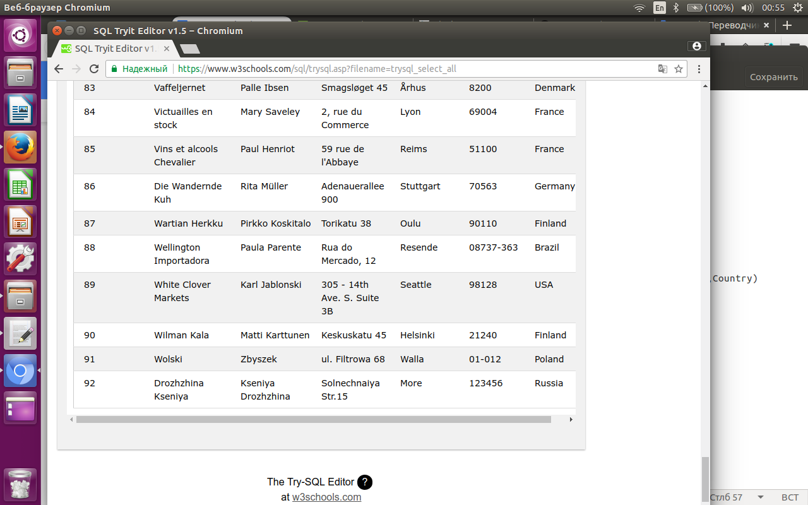

1. Количество клиентов из Германии 11;

```sql
SELECT count(*) FROM Customers
where Country like 'Germany'
```
2. Имена 14 клиентов начинаются с 'e'

```sql
SELECT count(CustomerName) FROM Customers
where CustomerName like '%e'
```

3. Вставка моего имени в список

```sql
insert into Customers (CustomerID,CustomerName,ContactName,Address,City,PostalCode,Country)
values (92,'Kseniya Drozhzhina','Kseniya Drozhzhina','Solnechnaiya Str.15','More','123456','Russia')
```


4. Изменение моего имени в таблице

```sql
update Customers set CustomerName = 'Drozhzhina Kseniya'
where CustomerID = 92
```


5. Удаление всех клиентов из города Nantes

```sql
delete FROM Customers 
where City = 'Nantes'
```


6. Номера заказов, оформленных для клиентов работником с именем Steven

```sql
SELECT OrderID
FROM Orders, FirstName
INNER JOIN Employees ON Employees.EmployeeID = Orders.EmployeeID
where FirstName='Steven'
```


